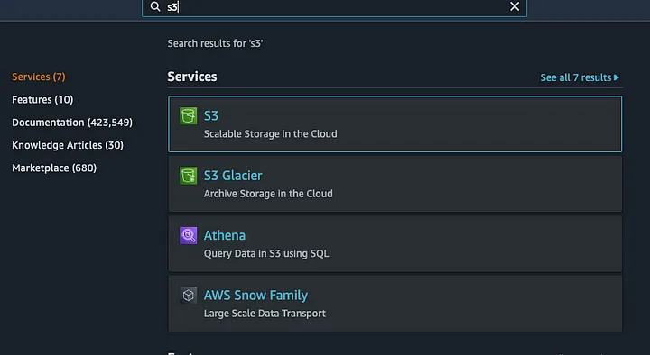
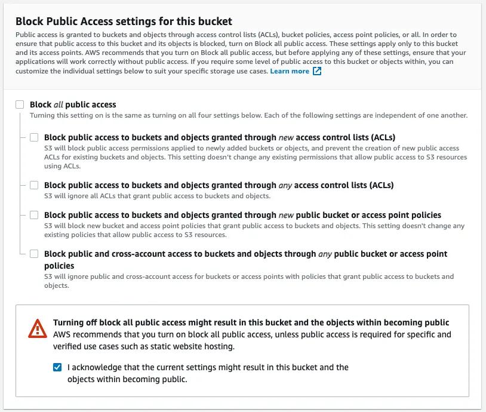
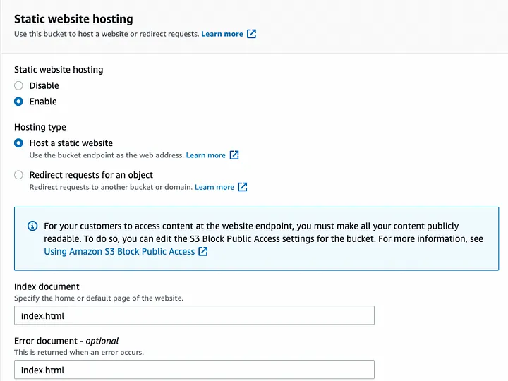
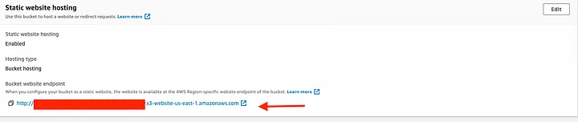

# Deploy ReactJS App with s3 static Hosting 


* Create a simple react app.
* Configure an S3 bucket for static web hosting.
* Deploy!

## Prerequisites

AWS Account created
AWS IAM User
AWS CLI installed (and additional dependencies)
AWS Credentials Locally Setup

Build Your React Application
- Before you start building your react application and to deploy your application directly to S3 from your machine, you’ll have to configure your AWS account using the AWS CLI that was requested in this tutorial, to do so, get into your terminal and follow those commands:

```sh
aws configure
AWS Access Key ID [None]: Your AWS key ID
AWS Secret Access Key [None]: Your AWS access key
Default region name [None]: Default region (i.e. us-east-1)
Default output format [None]: ENTER
```
* You’ll need to have Node 14.0.0 or later version on your local development machine (but it’s not required on the server). We recommend using the latest LTS version. You can use nvm (macOS/Linux) or nvm-windows to switch Node versions between different projects.


<!-- GETTING STARTED -->
## Getting Started

## Step 1: create or deploy a simple react app. 

1. create or clone a react application
 ```sh
 npm install -g create-react-app OR https://github.com/ripalshah710/react-demo.git
 ```

2. give name to your application 
```sh
npx create-react-app react-demo
```

3. go to project directory 
```sh
cd react-demo
```

4. Build the react application
Builds the app for production to the build folder.
It correctly bundles React in production mode and optimizes the build for the best performance.

The build is minified and the filenames include the hashes.
Your app is ready to be deployed!


```sh
npm run build 
```


## Step 2:Configure an S3 bucket for static web hosting.


1. login to your aws account 
   https://aws.amazon.com/console/


2. Open s3 bucket 
- Get into AWS and search for S3 in the search bar.




Click on the ‘Create Bucket’ button


Fill the bucket name, and untick ‘Block all public access’.

You’ll want to allow public access so everyone can access your website.
After that, you have to acknowledge the change you did by ticking the acknowledge warning on the bottom of this area.




Click on the ‘Create Bucket’ at the bottom of the creation page.
Get into your newly created bucket and click on the ‘Properties’ on the bucket’s navbar on the top.





Scroll to the bottom and click ‘Edit’ on the right side of ‘Static Web Hosting’, and copy the following settings:

Get back to the main bucket’s navbar and click on ‘Permissions’, and fill the following piece of code into the Bucket Policy area:
Make sure to change ‘your_bucket_name_here’ to your bucket name.

```sh
{
    "Version": "2012-10-17",
    "Statement": [
        {
            "Sid": "PublicReadGetObject",
            "Effect": "Allow",
            "Principal": "*",
            "Action": "s3:GetObject",
            "Resource": "arn:aws:s3:::your_bucket_name_here/*"
        }
    ]
}
```

3. Upload build/dist folder in the s3 bucket 
    
```sh
cd build 
aws s3 sync . s3://DEST_BUCKET// (give your bucket name )
```    
   (manually you can drag and drop build/dist folder files to s3 bucket)
 

Once finished, get into your S3 bucket and click on ‘Properties’, then scroll to the bottom and you’ll see a link to your hosted website.





Congratulations! You’ve successfully deployed your React application to the AWS S3 Static Web Hosting service.

And that’s how it’s done. Thanks for reading.


